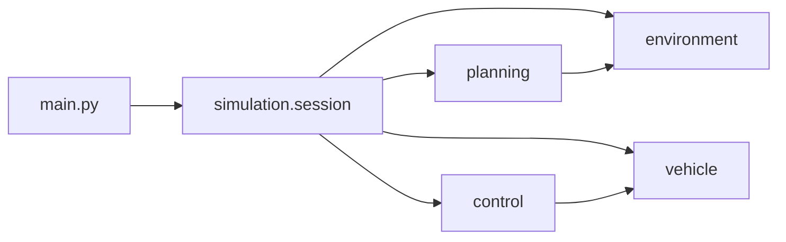

# 自动驾驶仿真系统

三车道静态障碍场景下的路径规划与跟踪仿真：可选 RRT / A* / RRT* 生成参考路径，再用 Pure Pursuit、Stanley 或名义 MPC（几何跟踪）控制自行车模型沿路径行驶，并用 matplotlib 输出轨迹图和 GIF。

## 运行环境

- Python 3.9+
- Linux / macOS / Windows（中文图注依赖系统字体；缺失时自动回退英文标签）

```bash
pip install -r requirements.txt
```

开发与测试：

```bash
pip install -r requirements-dev.txt
pytest
```

## 使用方法

交互仿真：

```bash
python main.py
python main.py --seed 42
```

启动后依次选择：

1. 路径规划：`1` RRT，`2` A*，`3` RRT*
2. 控制器：`1` Pure Pursuit，`2` MPC（菜单名沿用课设，实现为几何跟踪），`3` Stanley（推荐）

教学可视化（不跑闭环仿真）：

```bash
python visualize_road_environment.py
python visualize_road_environment_accurate.py
python visualize_vehicle_model.py
```

## 默认场景

| 项目 | 取值 |
|------|------|
| 道路 | 长 85 m，3 车道，车道宽 3.96 m |
| 车辆 | 长 4.0 m，宽 1.8 m |
| 起点 | (9.71, 第三车道中心) |
| 终点 | (80.0, 第一车道中心) |
| 障碍 | 4 辆静止车（x = 25.0 / 48.27 / 48.27 / 60.0） |
| 目标速度 | 4.0 m/s |
| 时间步 | 0.1 s，最长仿真 30 s |

参数集中在 [`autodrive/config.py`](autodrive/config.py)。改默认场景请改配置，不要在算法文件里再写一套魔法数。

## 输出文件

运行后写在当前工作目录（已加入 `.gitignore`，可随时重新生成）：

- `rrt_path_planning.png` / `astar_path_planning.png` / `rrt_star_path_planning.png`
- `simulation_results.png`
- `vehicle_animation.gif`
- 可视化脚本：`road_environment_visualization.png`、`road_environment_updated.png`、`vehicle_model_visualization.png`

## 项目结构

```
main.py                      # 命令行入口（菜单 + 随机种子）
visualize_*.py               # 环境 / 车辆模型示意图入口
autodrive/
  config.py                  # 场景、车辆、规划器、控制器默认参数
  environment.py             # 道路、障碍车、碰撞检测
  vehicle.py                 # 运动学自行车模型
  i18n.py                    # 中文字体与标签
  planning/                  # A* / RRT / RRT*
  control/                   # Pure Pursuit / Stanley / 名义 MPC
  simulation/                # 闭环仿真、结果图、动画
  viz/                       # 教学可视化
tests/                       # pytest 表征测试
requirements.txt
requirements-dev.txt
pyproject.toml
LICENSE
```



## 算法说明

**规划**

- **A***：栅格搜索，默认分辨率 0.5 m，规划结果不做拉普拉斯平滑
- **RRT**：随机树 + 自定义 AABB 膨胀碰撞；规划后再按 `smoothness=0.3` 平滑
- **RRT***：带重连；`planning()` 返回已平滑路径

三种规划器的碰撞实现并不相同（这是课设原行为，重构时未强行统一，以免改变路径）。

**控制**

- **Pure Pursuit**：前瞻点几何跟踪 + PI 调速
- **Stanley**：航向误差 + 横向误差的 arctan 项
- **MPC**：界面仍叫 MPC，代码是几何组合控制，不调用数值优化器

## 测试

```bash
pytest
```

测试使用 matplotlib `Agg` 后端，不会弹窗。闭环仿真用例使用桩控制器，不会跑满 2 万次 RRT。

## 许可证

MIT，见 [LICENSE](LICENSE)。
